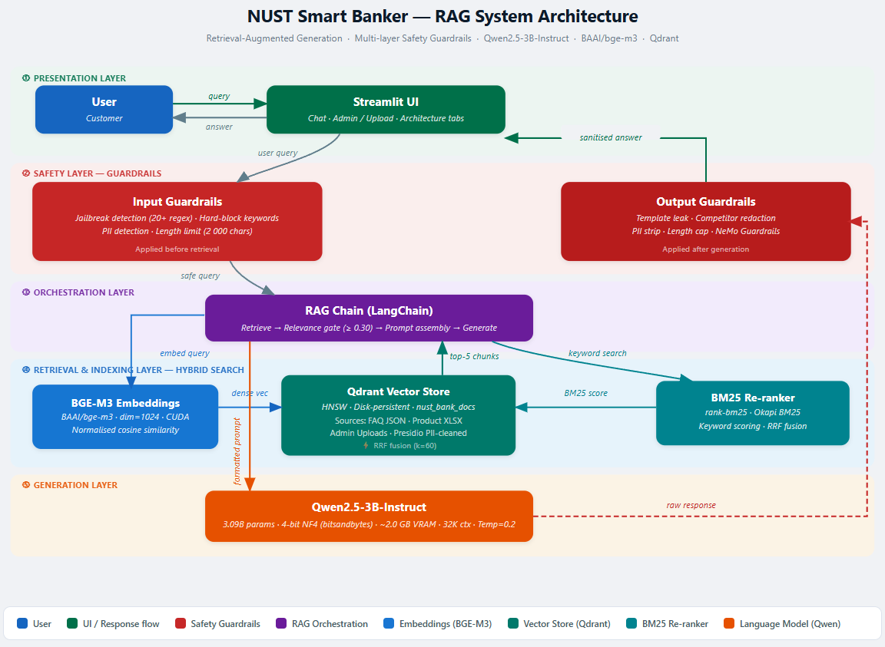

# NUST Smart Banker

An LLM-powered customer service assistant for NUST Bank, built with Retrieval-Augmented
Generation (RAG), persistent vector search, and multi-layer safety guardrails.



---

## Features

| Requirement | Implementation |
|---|---|
| Data Ingestion & PII Anonymisation | `src/ingest.py` — Presidio + regex, JSON & XLSX loaders |
| LLM | Qwen2.5-3B-Instruct (4-bit quantised via bitsandbytes) |
| Embedding & Vector Index | BAAI/bge-m3 + Qdrant (disk-persistent) |
| Hybrid Retrieval | Dense cosine similarity + BM25, fused via RRF |
| Prompt Engineering | Domain-locked system prompt, graceful OOD refusals |
| Real-Time Document Updates | Admin tab → instant ingest, no restart needed |
| Guardrails | Input jailbreak detection + output sanitisation + NeMo Guardrails |
| System Interface | Streamlit (Chat, Admin/Upload, Architecture tabs) |

---

## Project Structure

```
nust-smart-banker/
├── data/
│   ├── funds_transfer_app_features_faq.json
│   └── NUST Bank-Product-Knowledge.xlsx
├── src/
│   ├── __init__.py
│   ├── utils.py          # Text cleaning, chunking helpers
│   ├── ingest.py         # Data loaders, PII anonymisation, Qdrant upsert
│   ├── retriever.py      # BGE-M3 embeddings + hybrid search (dense + BM25)
│   ├── llm.py            # Qwen2.5-3B-Instruct loader + LangChain wrapper
│   ├── rag_chain.py      # End-to-end RAG pipeline + prompt engineering
│   └── guardrails.py     # Input/output safety checks, jailbreak detection
├── configs/
│   ├── settings.py       # All constants (paths, model names, thresholds)
│   └── rails.co          # NeMo Guardrails Colang config
├── architecture/
│   ├── diagram.py        # Script to regenerate architecture.png
│   └── architecture.png  # System architecture diagram
├── uploaded_docs/        # Stores admin-uploaded documents
├── qdrant_data/          # Qdrant on-disk vector store (auto-created)
├── app.py                # Streamlit UI
└── requirements.txt
```

---

## Setup

### Prerequisites

- Python 3.11
- CUDA-capable GPU with ≥ 6 GB VRAM (RTX 4050 or better)
- CUDA drivers installed

### Installation

```bash
git clone https://github.com/AtharRizwan/nust-smart-banker.git
cd nust-smart-banker

# Create and activate virtual environment (recommended)
python -m venv .venv
.venv\Scripts\activate          # Windows
# source .venv/bin/activate     # Linux / macOS

pip install -r requirements.txt
```

### Step 1 — Download All Models (run once)

Before launching the app, pre-download all models to the project's `.cache/`
directory on the E: drive so nothing needs to be fetched at runtime:

```bash
python setup_models.py
```

This will download (sequentially, with progress output):

| Model | Size | Purpose |
|---|---|---|
| `BAAI/bge-m3` | ~570 MB | Dense embeddings for retrieval |
| `Qwen/Qwen2.5-3B-Instruct` | ~6 GB (fp16) | LLM answer generation |
| `en_core_web_lg` | ~700 MB | spaCy NLP for Presidio PII detection |

> **One-time only.** On subsequent runs all models load from `.cache/` — no internet required.

### Step 2 — Index the Knowledge Base (run once)

The knowledge base is indexed **automatically** the first time you launch the app.
To pre-build the index manually:

```bash
python -m src.ingest
```

---

## Running the App

```bash
streamlit run app.py
```

Open `http://localhost:8501` in your browser.

On the **first launch**:
1. The BGE-M3 embedding model (~570 MB) downloads from Hugging Face.
2. All data files are ingested and indexed (~200+ document chunks).
3. Qwen2.5-3B-Instruct (~1.8 GB in 4-bit) downloads and loads on the first query.

Subsequent launches use the cached Qdrant index and cached model weights.

---

## Usage

### Chat Tab

Type a question about NUST Bank in the chat box, for example:

- *"What accounts does NUST Bank offer?"*
- *"How do I change my transfer limit?"*
- *"Who can apply for NUST Personal Finance?"*
- *"What is the Little Champs Account?"*

Suggested starter questions appear when the chat is empty.

### Admin / Upload Tab

1. Select a file (`.json`, `.xlsx`, or `.txt`)
2. Optionally enter a source label
3. Click **Ingest Document** — the file is parsed, anonymised, embedded, and indexed immediately
4. New information is instantly available in the Chat tab

### Adding New Documents via CLI

```bash
python -m src.ingest --file /path/to/new_faq.json --label "New Credit Card FAQ"
python -m src.ingest --file /path/to/policy_update.txt --label "Transfer Policy Jan 2026"
```

---

## Fine-Tuning Qwen2.5-3B-Instruct

The project includes an end-to-end, reproducible QLoRA fine-tuning pipeline to tailor the base Qwen model to NUST Bank's specific knowledge base and conversational tone.

### 1. Build the Dataset
Extract Q&A pairs from all ingested documents and automatically format them into ChatML with negative (out-of-domain refusal) samples:
```bash
python finetune/build_dataset.py
```
*(Outputs `train.jsonl` and `eval.jsonl` to `finetune/data/`)*

### 2. Run QLoRA Training
Executes 4-bit PEFT training (automatically uses Unsloth on Linux/Colab or HuggingFace TRL on Windows):
```bash
python finetune/train.py --epochs 3
```
**Performance Metrics Achieved:**
- **Validation Loss:** `0.784`
- **Token Accuracy:** `83.4%` on the evaluation set (gracefully reverted to Best Checkpoint using early stopping parameters)

### 3. Merge & Export
Merge the trained LoRA adapter weights directly into the base Qwen model:
```bash
python finetune/merge_and_export.py
```
This generates a complete standalone model at `finetune/outputs/merged_model`.

### 4. Enable in Production
Copy `.env.example` to `.env` and set the override path:
```dotenv
LLM_MODEL_PATH=[path-to-project]/finetune/outputs/merged_model
```
Restart the Streamlit app. The Chat tab will now be using the customized NUST Bank assistant!

---

## Model Details

| Property | Value |
|---|---|
| Model | Qwen/Qwen2.5-3B-Instruct |
| Parameters | 3.09 Billion |
| Quantisation | 4-bit NF4 (bitsandbytes) |
| Context Window | 32,768 tokens |
| VRAM Usage | ~2.0 GB (4-bit) |
| Temperature | 0.2 (factual/low-creativity) |

**Why Qwen2.5-3B-Instruct?**
- Within the 6B parameter limit with room to spare
- Superior structured data understanding (tables, rates, limits)
- 32K token context window for long policy documents
- Multilingual capability for diverse customer base
- Strong instruction-following for prompt engineering

---

## Safety & Guardrails

The system implements a two-layer safety architecture:

**Input Guardrails** (`src/guardrails.py`):
- 20+ regex patterns detecting prompt injection (`ignore previous instructions`, `act as DAN`, etc.)
- Hard-block keyword list (harmful/adult/violence topics)
- PII detection in queries
- Query length limit (2000 chars)

**Output Guardrails** (`src/guardrails.py`):
- Template token leak detection (`<|im_start|>`, `<<SYS>>`)
- Competitor bank mention redaction
- PII sanitisation in responses
- Response length cap (3000 chars)

**NeMo Guardrails** (`configs/rails.co`):
- Colang-defined conversation flows for out-of-domain, jailbreak, and sensitive data requests
- Complements the programmatic checks above

**Domain Relevance Gate**:
- If retrieved document scores fall below the relevance threshold (0.30), the system responds with a polite out-of-domain refusal rather than hallucinating an answer

---

## Regenerating the Architecture Diagram

```bash
python architecture/diagram.py
```

---

## Configuration

All tuneable parameters are in `configs/settings.py`:

| Parameter | Default | Description |
|---|---|---|
| `EMBEDDING_MODEL_NAME` | `BAAI/bge-m3` | Embedding model |
| `LLM_MODEL_NAME` | `Qwen/Qwen2.5-3B-Instruct` | Language model |
| `CHUNK_SIZE` | 512 | Characters per chunk |
| `CHUNK_OVERLAP` | 64 | Overlap between chunks |
| `RETRIEVAL_TOP_K` | 5 | Documents returned per query |
| `RELEVANCE_THRESHOLD` | 0.30 | Minimum score to attempt generation |
| `LLM_MAX_NEW_TOKENS` | 512 | Max response length |
| `LLM_TEMPERATURE` | 0.2 | Generation temperature |
| `LLM_LOAD_IN_4BIT` | `True` | 4-bit quantisation |
